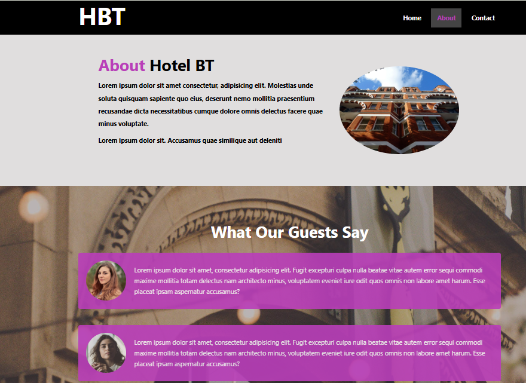

Welcome to my Hotel Website — a simple, static website project built using HTML and CSS. 
This project was created to practice my frontend web development skills as I learn the basics of building responsive and visually appealing websites.
This project is part of my web development learning journey. It’s a basic hotel website built with HTML and CSS, focusing on structure, styling, and mobile responsiveness.
---

